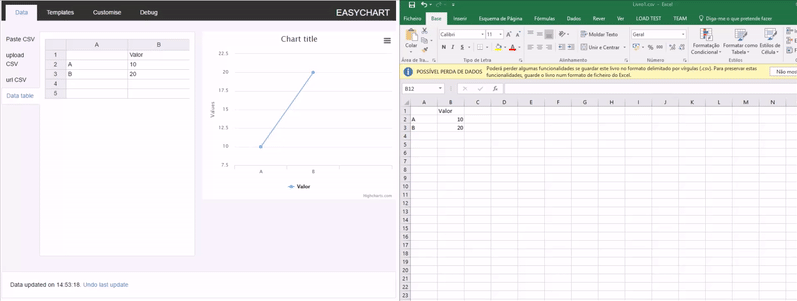
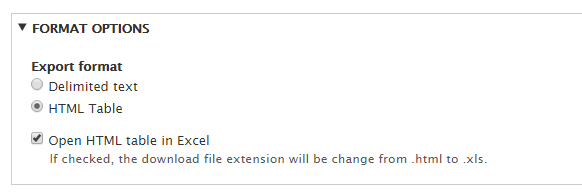
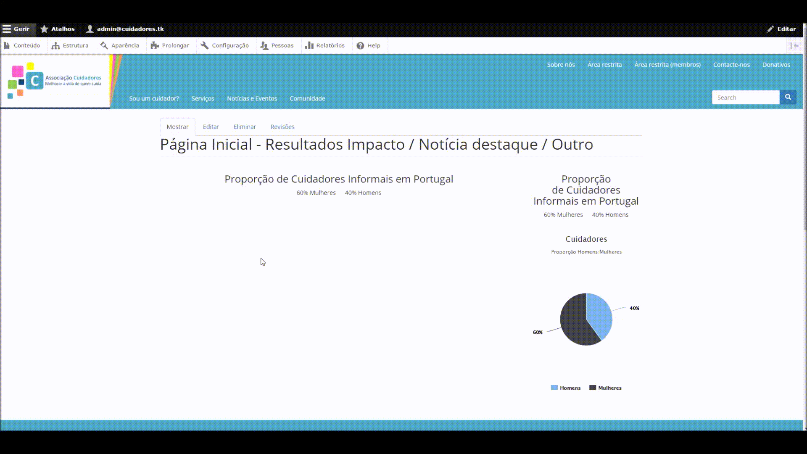

# Associação Cuidadores

- [Getting started](#getting-started)
  - [Prerequisites](#prerequisites)
  - [Installation](#installation)
    - [Website](#website)
    - [Mobile app](#mobile-app)
  - [Running the tests](#running-the-tests)
  - [Updating](#updating)
- [Usage](#usage)
  - [Account system](#account-system)
  - [Charts](#charts)
  - [Forms](#forms)
  - [Newsletter](#newsletter)
  - [Custom content](#custom-content)
  - [Export user info](#export-user-info)
- [System architecture](#system-architecture)
  - [Built width](#built-width)
  - [Technological architecture](#technological-architecture)
- [Versioning](#versioning)
- [Credits](#credits)

## Getting started

### Prerequisites

- Apache web server.
- PHP 5.5.9 or higher.
- Minimum 512MB disk space in the web server. Keep in mind you need much more for the database, files uploaded by the users, media, backups and other files.
- MySQL 5.5.3 or higher with PDO and an InnoDB-compatible primary storage engine.
- SSH (command-line) access to the server folders.

### Installation

#### Website

1. Open a command line on folder `/web/scripts/`.
2. Copy the file `/web/sites/default/settings.local.example.php` to `/web/sites/default/settings.local.php` and update it with the configurations of your database, as well as the folder where the temporary files will be stored.
3. Copy the file `/web/comunidade/config.local.example.php` to `/web/comunidade/config.local.php` and update it with your database configurations, as well as the path to the online community page.
4. Copy the file `/web/register/config.local.example.php` to `/web/register/config.local.php` and update it with your SMTP server configuration, as well as the website's address and administrator's email.
5. Open a command line in folder `/web/scripts/`.
6. Run the command `install.bat <dbuser> <dbpass> <dbname>`. If the database has no _password_ write `""` in the `<dbpass>` field.
7. In order for the admin to be automatically notified when a community user becomes an adult, a cronjob must be set up. This means adding the following line to the crontab file: `0 0 * * * php -q /var/www/staging/comunidade/young_adult/notify_admin.php`

#### Mobile app
1. Get the website up and runnning.
2. Install latest Node.js.
3. Run `npm install -g cordova ionic`.
4. To test the app in your browser run `ionic serve`.

### Running the tests
The website unit tests use PHPUnit and can be run with the following command: `/web/core/vendor/bin/phpunit --testsuite=unit`.
The website acceptance tests use Selenium and Google Chrome as the browser. They can be run with the following command: `/web/scripts/acceptance/compile_and_run.bat`.

### Updating

#### Drupal
You are highly recommended not to update Drupal, unless a security update is available. The reason for this is that some files that are modified by the update must be manually edited to restore their original content.

To update, the "Update Manager" module must be enabled. Then you should backup the following files:
- .htaccess
- robots.txt
- core/lib/Drupal/Core/Password/PhpassHashedPassword.php

After updating, you must merge the files you previously backed up with the new changes. Also, you need to remove the following test files:
- core/lib/Drupal/Core/Password/PhpassHashedPassword.php
- core/tests/Drupal/Tests/Core/PageCache/CommandLineOrUnsafeMethodTest.php

#### Flarum
Run `composer update` in a command line open on folder `/web/comunidade/`.

## Usage
In this section, the usage of specific parts of the website will be explained.

### Account system
To create an account, one can access the "Reserved area" in the top menu of the website or click the "Sign up" button located in the forum's header.

After choosing an email address, the user will be asked what parts of the system he wants to be registered to: website and/or forum.

If the website checkbox is ticked, he will be asked his name and associate number (both are optional fields). If the forum checkbox is ticked he will be asked to enter an username and his birth date. According to that birth date, he will be automatically assigned to the young (17-) or adult (18+) forum.

This way, the user is able to fully separate his website and forum accounts while still keeping a small connection between them (e-mail and password are shared between both accounts).

### Charts
The system allows the creation of charts with custom data, using EasyChart. Here is an example of how a chart can be created (in this case a pie chart imported from an Excel spreadsheet):

### Forms
The module chosen to display customizable forms was YAMLForms. It has two important features that were requirements of the project: the administrator is able to easily customize it and to export the results to an Excel spreadsheet, by choosing the following options in the form export page:

In order to edit the input fields of a form, the administrator must go to Structure > Forms > Edit (in the line corresponding to the form to be edited).

### Newsletter
The newsletter system allows the subscription of guests or logged-in users. It also allows the administrator to manually specify custom e-mails that he wants to send the newsletter to:

### Custom content
Some special content of the website can be created using the appropriate content type. The following list explains some of the custom content types available:
- **Chart:** Creates a chart (using EasyChart) to be displayed in the sidebar of the main page.
- **Event:** Creates a new event that will be displayed in the calendar and in the News & Events section.
- **News:** Creates a news article that will be displayed in the News & Events section as well as the main page.
- **Partner:** Adds an image to the Partners/Supporters section.
- **Responsive slideshow:** Adds a new image to the main page slideshow.
- **Newsletter issue:** Creates a new issue of a newsletter, to be later sent to the subscribers.
- **Training video:** Adds a new video to the Training Videos section.

### Export user info
The administrator is able to export a list of all users of both the website and community to an Excel spreadsheet. In order to do that, one must acess the Configuration page and click "Export User Information" in the development section. The generated spreadsheet contains the following columns:
- **Account type:** Can be one of three values: "Website", "Community" or "Both". The value depends on where the user is registered.
- **Email:** The email of the user.
- **Name:** The name of the user (optional field).
- **Associate number:** The associate number of the user (optional field).
- **Username:** The username of the user (if registered in the forum).
- **Age group:** Young (17-) or Adult (18+).
- **Account activated:** Activated or Not Activated, depending on whether or not the user has activated the email associated to the account.

## System architecture

### Built width
- Drupal 8.2.4
- Flarum 0.1.0
- Ionic

### Technological architecture
The project has three main components, each based on a different technological framework. The institutional website is built on Drupal, the forum on Flarum and the mobile app on Ionic.
The choice of Drupal for the website was made due to the requirement that pages should be easily added without the need to alter the source code. Taking into consideration that the Product Owner wanted the final product to be similar to the website [carers.org](http://carers.org), the same content management system (CMS) was chosen.
Flarum was chosen to provide a robust, intuitive and appealing forum to the client, with an interesting interaction, making it enjoyable to communicate with others.
Ionic is used to keep a single codebase to deploy to both Android and iOS platforms so that it is possible to cover as many users as possible.
All frameworks used are open-source, since that property is also a requirement of the project.
The languages used are the following:
- **Server:** PHP;
- **Client:** HTML, CSS, Javascript;
- **Mobile app:** HTML, CSS, AngularJS.

## Versioning
We use [SemVer](http://semver.org/) for versioning. For the versions available, see the [tags on this repository](https://github.com/gtugablue/LDSO/tags). 

## Credits
- André Lago ([@andrelago13](https://github.com/andrelago13))
- Diogo Carvalho ([@DiogoVazC](https://github.com/DiogoVazC))
- Guilherme Pinto ([@guilhermevpinto](https://github.com/guilhermevpinto))
- Gustavo Silva ([@gtugablue](https://github.com/gtugablue))
- José Rebelo ([@joserebelo](https://github.com/joserebelo))
- Pedro Castro ([@F0lha](https://github.com/F0lha))
- Ricardo Cerqueira ([@ricardocerq](https://github.com/ricardocerq))
